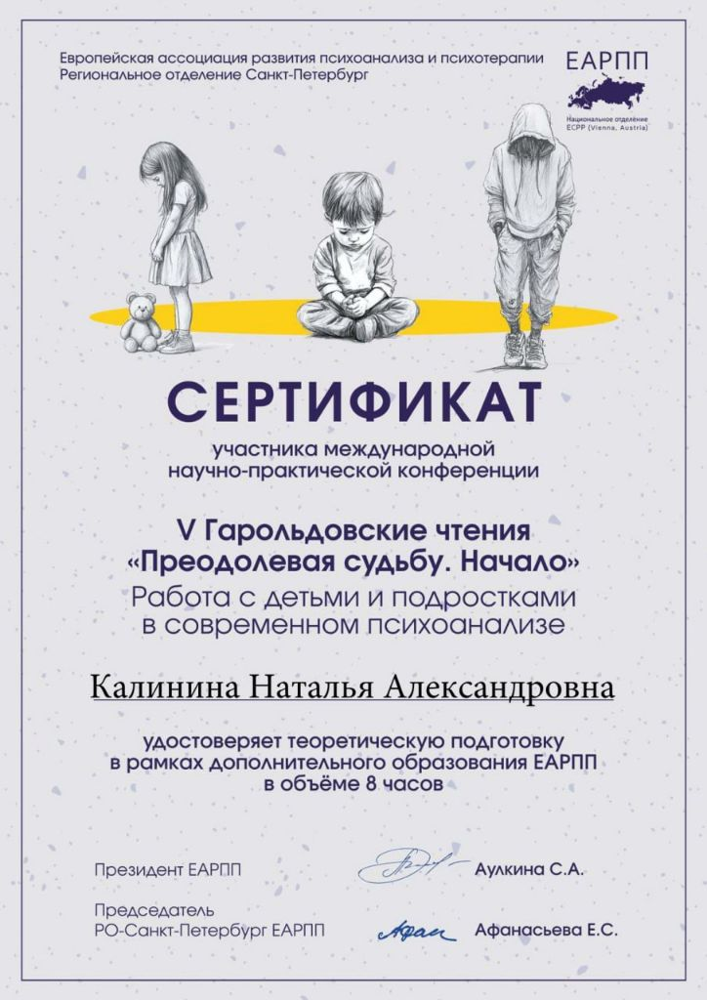

# ✅ ОБНОВЛЕНИЕ: ДОБАВЛЕНЫ ФОТО И СЕРТИФИКАТЫ

## 🎉 Что добавлено:

### 📸 Фотографии профиля:
- ✅ **profile-1.jpg** (58 KB) - белая рубашка, серый фон
- ✅ **profile-2.jpg** (54 KB) - белая рубашка, коричневый фон
- ✅ **profile-photo-1.jpg** (58 KB) - дубликат для разных страниц
- ✅ **profile-photo-2.jpg** (54 KB) - дубликат для разных страниц

### 🏆 Сертификаты JPG:
- ✅ **cert-earpp-1.jpg** (97 KB) - сертификат ЕАРПП №1
- ✅ **cert-earpp-2.jpg** (101 KB) - сертификат ЕАРПП №2
- ✅ **cert-samara.jpg** (97 KB) - конференция в Самаре "Ресурсы психоаналитика"
- ✅ **cert-garoldy.jpg** (101 KB) - V Гарольдовские чтения

### 📄 Сертификаты PDF:
- ✅ **diplomy.pdf** (1.3 MB) - диплом МГУ (филолог) + другие
- ✅ **cert-supervizii.pdf** (1.0 MB) - сертификат супервизий

---

## 📊 Итого:

**10 файлов** общим размером **~2.8 MB**

✅ Все фотографии профессионального качества  
✅ Все сертификаты в высоком разрешении  
✅ Готовы к использованию на сайте  

---

## 🎨 Где используются:

### Уже на сайте:
- **index.html** → profile-photo-1.jpg (главная страница)
- **about.html** → profile-photo-2.jpg (обо мне)
- **credentials.html** → cert-earpp-1.jpg, cert-earpp-2.jpg (регалии)

### Можно добавить:
- **credentials.html** → cert-samara.jpg, cert-garoldy.jpg (дополнительные сертификаты)
- Ссылки на PDF для скачивания/просмотра

---

## 💡 Как добавить больше сертификатов:

Откройте **credentials.html** и найдите секцию "Сертификаты и квалификации".

Добавьте новые карточки по образцу:

```html
<div style="background: var(--bg-light); padding: 1.75rem; border-radius: 12px; text-align: center;">
    <div style="width: 60px; height: 60px; background: var(--primary-color); color: white; border-radius: 50%; display: flex; align-items: center; justify-content: center; font-size: 1.5rem; margin: 0 auto 1rem;">
        <i class="fas fa-certificate"></i>
    </div>
    <h4 style="color: var(--primary-color); margin-bottom: 0.5rem; font-size: 1.1rem;">Конференция в Самаре</h4>
    <p style="color: var(--text-medium); font-size: 0.95rem;">"Ресурсы психоаналитика" (2023)</p>
</div>
```

Или создайте галерею с изображениями:

```html
<div style="display: grid; grid-template-columns: repeat(auto-fit, minmax(300px, 1fr)); gap: 2rem; margin-top: 3rem;">
    <div style="text-align: center;">
        
        <h4 style="color: var(--primary-color);">Конференция в Самаре</h4>
        <p style="color: var(--text-medium);">2023</p>
    </div>
    <div style="text-align: center;">
        
        <h4 style="color: var(--primary-color);">Гарольдовские чтения</h4>
        <p style="color: var(--text-medium);">2023</p>
    </div>
</div>
```

---

## 📥 PDF файлы:

Можно добавить ссылки для скачивания на странице "Регалии":

```html
<div style="margin-top: 3rem; text-align: center;">
    <h3 style="color: var(--primary-color); margin-bottom: 2rem;">Документы для скачивания</h3>
    <div style="display: flex; gap: 1rem; justify-content: center; flex-wrap: wrap;">
        <a href="images/diplomy.pdf" target="_blank" class="btn btn-outline" style="border-color: var(--primary-color); color: var(--primary-color);">
            <i class="fas fa-file-pdf" style="margin-right: 0.5rem;"></i>
            Скачать дипломы (PDF)
        </a>
        <a href="images/cert-supervizii.pdf" target="_blank" class="btn btn-outline" style="border-color: var(--primary-color); color: var(--primary-color);">
            <i class="fas fa-file-pdf" style="margin-right: 0.5rem;"></i>
            Сертификат супервизий (PDF)
        </a>
    </div>
</div>
```

---

## ✅ Всё готово!

Теперь в папке `images/` есть **ВСЕ** необходимые фотографии и сертификаты!

Подробная информация о каждом файле - в **images/README.md**

---

**Дата обновления:** 30 января 2026  
**Статус:** ✅ ПОЛНЫЙ КОМПЛЕКТ ФОТО И СЕРТИФИКАТОВ